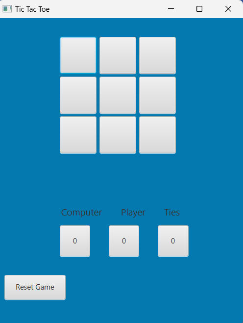

# Tic Tac Toe with AI

This is a Java implementation of the classic Tic Tac Toe game with an intelligent AI opponent. The AI uses the Minimax algorithm with Alpha-Beta pruning to make optimal moves.

## Screenshot

## Features

- Graphical user interface built with JavaFX
- Player vs AI gameplay
- Intelligent AI using Minimax algorithm with Alpha-Beta pruning
- Game statistics tracking (player wins, AI wins, draws)
- Automatic game reset after each round

## Requirements

- Java Development Kit (JDK) 8 or higher
- JavaFX (included in JDK 8, but may need to be added separately for later versions)

## How to Run

1. Compile the Java files:
2. Run the game:
## How to Play

1. The game starts with an empty 3x3 grid.
2. The player is 'X' and the AI is 'O'.
3. Click on any empty cell to make your move.
4. The AI will automatically make its move after the player.
5. The game ends when either the player or AI gets three in a row (horizontally, vertically, or diagonally), or when the board is full (a draw).
6. The game will automatically reset after each round, and the statistics will be updated.

## Code Structure

- `TicTacToeGame.java`: Contains the main game logic and UI implementation.
- `MinimaxAI.java`: Implements the AI using the Minimax algorithm with Alpha-Beta pruning.

## Future Improvements

- Add difficulty levels for the AI
- Implement a menu system for game options
- Add sound effects and animations
- Allow player to choose their symbol (X or O)
- Implement a two-player mode

## Contributing

Feel free to fork this project and submit pull requests with improvements or bug fixes. For major changes, please open an issue first to discuss what you would like to change.

## License

[MIT License](https://choosealicense.com/licenses/mit/)
